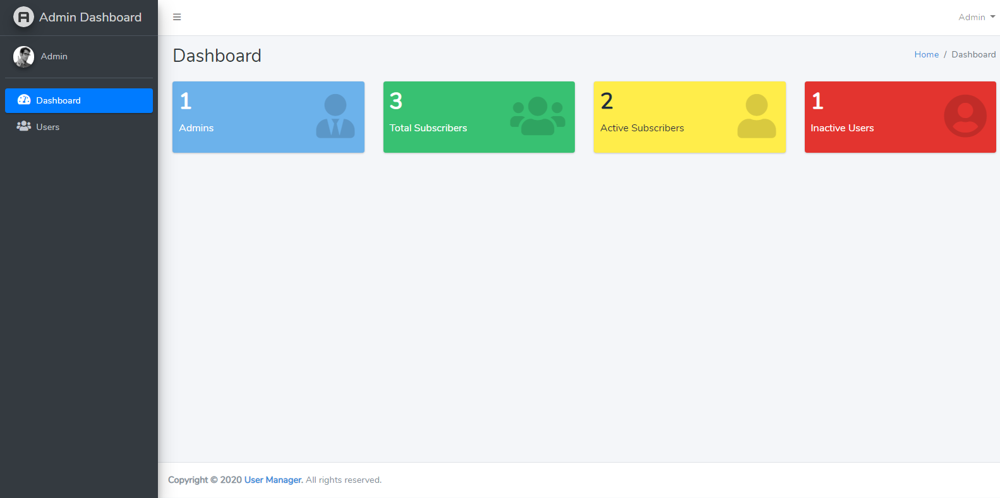

# User Management System

## Setup Instructions

1. Clone Repository `git clone https://github.com/tridibdawn/User-Management-System.git`

2. Copy contents from `.env.example` to `.env` file

3. Setup database creadentials in `.env`

4. Run `composer install`

5. Run `php artisan key:generate`

6. Run `php artisan migrate`

7. Run `php artisan db:seed`

8. Run `npm install`

9. Run `npm run dev`

10. Run `php artisan serve` and visit the url `(e.g. http://127.0.0.1:8000)`

11. Now you are all set to run the application in your local machine. ___Happy Coding___.

## Demo Link

* Link: <a href="https://www.awesomescreenshot.com/video/844348?key=2bb7c8b01e13b880df7c4e31514ba56c" target="_blank">https://www.awesomescreenshot.com/video/844348?key=2bb7c8b01e13b880df7c4e31514ba56c</a>

## Documentation Link

* Link: <a href="https://drive.google.com/drive/folders/1OCx-afyG0L11trcQafIerHvdS7avoP1B?usp=sharing" target="_blank">https://drive.google.com/drive/folders/1OCx-afyG0L11trcQafIerHvdS7avoP1B?usp=sharing</a>

## Minimum Requirements

* PHP 7.3

* Composer

* NPM

## Admin Credentials

* Email: admin@example.com

* Password: password
